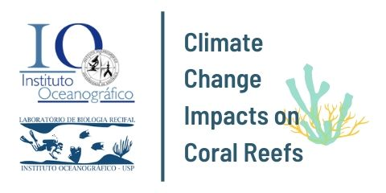

<!-- README.md is generated from README.qmd. Please edit that file -->

#  Modeling the Species Distribution of Sea Urchins in the Western Atlantic

## Introduction

This project assessed how climate change will impact the distribution of
three key species of sea urchins in the Western Atlantic. This was done
through SDMs produced using LGCP models under a Bayesian framework. For
more details, reader is referred to the publication “A thorny future for
sea urchins in the Tropical Western Atlantic” (under review). All codes
and data used in the study are available in this folder, except original
climatic layers, which are available online.

## Interactive results

An interactive version of the results of this work is availabe at
[silasprincipe.github.io/herbinv](http://silasprincipe.github.io/herbinv)

## Files included

**data**: all data used in the study  
– **env**: environmental data  
– **lyva**: *Lytechinus variegatus* data  
– **eclu**: *Echinometra lucunter* data  
– **trve**: *Tripneustes ventricosus* data  
– **sst_limits**: SST data for the thermal limits part **codes**: all
codes used in the study  
**functions**: all functions that were used either directly or as
support in the study **gis**: shapefiles

### Codes

- data\_\*: data download and preparing  
- prep\_\*: prepare data (environmental variables)  
- lgcp_prepare_data: prepare all data necessary for fitting the LGCP
  model through INLA  
- lgcp_model\_\*: models for each species
- plot\_\*: produce figures
- sst\_\*: codes used for producing the mechanistic model or for
  estimating thermal limits  
- supp\_\*: supplementary analysis

## Related repositories

- Species Distribution Modeling of reef building coral species of the
  Western Atlantic:
  [silasprincipe/reefbuilders](https://github.com/silasprincipe/reefbuilders)

------------------------------------------------------------------------

Please, contact us if you have any questions on how to use the codes.
